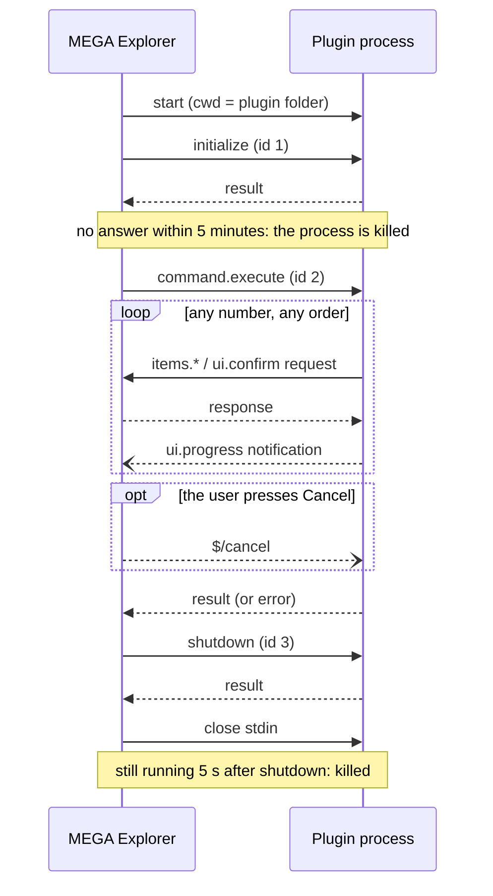

# Writing plugins for MEGA Explorer

> **The plugin API is experimental and will change.** MEGA Explorer is before 1.0, and the plugin
> protocol described here is its first version. Any release — including a minor or patch one —
> may add, rename or remove methods, fields, manifest keys or error codes without keeping the old
> form working. Check this page again whenever you update the app, and pin the app version your
> plugin was tested against.
>
> This page describes the app as of version **0.5.0** (protocol `apiVersion` **1**).

A plugin adds commands to the right-click menu. When the user picks one, the app starts the
plugin as a separate process, talks to it over JSON-RPC on stdin/stdout, and shows the result.
The plugin can read the items in the account, change their name, description, favourite and tags,
fetch their previews, report progress and ask the user to confirm — it never touches the MEGA
SDK, a session or a password itself.

Any language works: the app only knows how to start a program and exchange JSON lines with it.
The sample in [`plugin_sample/`](plugin_sample/) is written in Python with a small helper
library, which is the quickest way to start.

**Security.** A plugin is an ordinary program running with your Windows user's rights, and through
the API it can modify any item in the signed-in account. The manifest's [permissions](#permissions)
limit which API methods the app will serve it, but they are not a sandbox: the process itself can
do anything your Windows user can. There is no consent prompt: every plugin in the plugins folder is
enabled. Only install plugins you trust.

## Contents

- [Quick start](#quick-start)
- [How a plugin runs](#how-a-plugin-runs)
- [The manifest (`plugin.json`)](#the-manifest-pluginjson)
  - [API version](#api-version)
  - [Permissions](#permissions)
- [Protocol](#protocol)
  - [Transport](#transport)
  - [Items and handles](#items-and-handles)
  - [Messages from the app](#messages-from-the-app)
  - [Methods the plugin can call](#methods-the-plugin-can-call)
  - [Notifications from the plugin](#notifications-from-the-plugin)
  - [Error codes](#error-codes)
- [What the user sees](#what-the-user-sees)
- [Developing a plugin](#developing-a-plugin)
- [The Python helper](#the-python-helper)
- [Not in this version](#not-in-this-version)

## Quick start

1. Install [uv](https://docs.astral.sh/uv/) (the sample starts with `uv run`).
2. Create a folder in the plugins folder (see [Developing a plugin](#developing-a-plugin) for its
   location), e.g. `plugins\hello\`, holding three files:

   `plugin.json`

   ```json
   {
     "id": "com.example.hello",
     "name": "Hello",
     "version": "0.1.0",
     "apiVersion": 1,
     "run": { "command": "uv", "args": ["run", "--quiet", "main.py"] },
     "commands": [
       { "id": "count", "title": "Count the selection" }
     ]
   }
   ```

   `main.py`

   ```python
   from megaexplorer_plugin import Plugin

   plugin = Plugin()

   @plugin.command("count")
   def count(ctx):
       return f"{len(ctx.items)} item(s) selected"   # shown as a toast

   plugin.run()
   ```

   `megaexplorer_plugin.py` — a copy of
   [`plugin_sample/megaexplorer_plugin.py`](plugin_sample/megaexplorer_plugin.py).

3. Restart MEGA Explorer, right-click a file, and pick **Hello › Count the selection**.

## How a plugin runs

- **Discovery.** At startup the app reads `<plugins folder>/<any folder>/plugin.json`. A manifest
  that fails to parse is skipped with a line in the log; so is a second plugin with an `id`
  already taken. Plugins are listed by `name`.
- **Menu.** Each plugin gets a submenu, holding one row per command, in three context menus:
  - of selected items (Cloud Drive, Favourites, Recents and Shared links views),
  - of a view's empty space, for the folder the view is showing,
  - of a row in the side panel's folder tree or Quick access, for that folder.

  The last two hand over one folder, so a command with `"when": {"targets": "folders"}` runs
  there too — including on **Cloud Drive** itself, the one folder no selection can reach. At the
  top of Favourites, Recents or Shared links the empty space stands for no folder, and the rows
  are greyed out.
- **One process per click.** Every click starts a fresh process, which handles exactly one
  command and then exits. Nothing is kept between runs; a plugin that needs state stores it itself
  (where is up to the plugin: its own folder, `%APPDATA%`, …).
- **One run per plugin at a time.** While a plugin is running, its commands are greyed out.
  Different plugins can run side by side.
- **Process tree.** The plugin is started inside a Windows Job Object, so its own child processes
  (`uv`'s `python.exe`, for instance) are killed along with it when it is stopped, and when the app
  exits.
- **Killed without notice.** When the user signs out, or closes the app, every running plugin is
  killed at once: no `$/cancel`, no `shutdown`, no chance to clean up. It can stop part-way through
  changing an item (an `items.update` applies its changes one by one), so write a plugin that can
  simply be run again — skip what is already done, and redo an item whose change is incomplete.
  Signing out in *another* MegaExplorer process that shares the session is not noticed: the run
  carries on, and its calls fail.

The sequence of one run:



`command.execute` has no time limit. If `initialize` fails, the app skips straight to `shutdown`.

## The manifest (`plugin.json`)

```json
{
  "id": "com.example.tagger",
  "name": "Tagger",
  "version": "1.2.0",
  "description": "Tags images with what is in them.",
  "repositoryUrl": "https://github.com/example/tagger",
  "apiVersion": 1,
  "run": { "command": "uv", "args": ["run", "--quiet", "main.py"] },
  "permissions": ["items.read", "items.edit", "content.read"],
  "commands": [
    {
      "id": "tag-selected",
      "title": "Tag selected",
      "when": { "targets": "files", "extensions": ["jpg", "png"] },
      "progress": { "show": ["count", "rate", "elapsed", "remaining"] },
      "result": "dialog"
    }
  ]
}
```

| Key | Required | Meaning |
| --- | --- | --- |
| `id` | yes | Unique id, `[a-z0-9][a-z0-9.-]*`. A reverse domain name is a good habit. |
| `name` | yes | Submenu label, and the name in toasts and dialogs. |
| `version` | no | Your plugin's version; passed back to you in `initialize`. |
| `description` | no | A short description of what the plugin does, shown in **Settings › Plugins**. |
| `repositoryUrl` | no | Where the plugin's source or home page lives. Only an `http://` or `https://` URL is kept; anything else is ignored. Shown as a link in the plugin's details in **Settings › Plugins**. |
| `apiVersion` | yes | The plugin API version the plugin was written for, a positive integer. See [API version](#api-version). |
| `run.command` | yes | The program to start. Without a `/` or `\` it is looked up on `PATH`; with one, it is relative to the plugin folder (e.g. `bin/plugin.exe`). |
| `run.args` | no | Arguments, as an array of strings. No shell is involved, so no quoting or expansion happens. |
| `permissions` | no | The API permissions the plugin uses, as an array of strings. See [Permissions](#permissions). Default: none. |
| `commands` | yes | At least one command. |
| `commands[].id` | yes | Unique within the plugin, no `/`. Sent as `commandId`. |
| `commands[].title` | yes | Menu row label. |
| `commands[].when.targets` | no | `"files"`, `"folders"` or `"any"` (default). |
| `commands[].when.extensions` | no | File extensions the command accepts, case-insensitive, leading `.` optional. Folders never match. |
| `commands[].progress` | no | `true` shows a progress dialog with a Cancel button as soon as the command starts. Default `false`: the dialog appears only once the command has run for 3 seconds. An object instead of `true` does the same and also picks the figures under the bar, see below. `"never"` shows no progress dialog at all, see [What the user sees](#what-the-user-sees). |
| `commands[].progress.show` | no | Which figures the progress dialog shows under its bar, any of `"count"`, `"rate"`, `"elapsed"`, `"remaining"`; see [`ui.progress`](#uiprogress). Default (and with `"progress": true`): none, only the message and the bar. |
| `commands[].result` | no | Where the result goes: `"toast"` (default) or `"dialog"`. See [What the user sees](#what-the-user-sees). |

A command whose `when` rejects any item of the selection is shown **greyed out**, not hidden.

The sample also carries `"manifestVersion": 1`. This version of the app does not read it.

### API version

The app speaks exactly one version of the plugin API, currently **1**, and `apiVersion` declares
which one a plugin was written for. The number goes up only when the API changes in a way that
breaks existing plugins; additions (a new method, a new optional field) leave it alone.

When the two differ, the plugin still appears in the menu, but its commands are greyed out and
never started, the submenu reads `<name> (incompatible)`, and **Settings › Plugins** greys it out. The log says which side is behind:
a plugin written for a lower version needs updating to the current API, one written for a higher
version needs a newer MEGA Explorer. A manifest without a valid `apiVersion` is rejected like
any other broken manifest.

### Permissions

Every method the plugin calls on the app needs one permission, declared in `permissions`:

| Permission | Methods | Allows |
| --- | --- | --- |
| `items.read` | `items.get`, `items.children`, `items.descendants` | Reading the tree: names and attributes of any item in the account |
| `items.write` | `items.upload`, `items.createFolder`, `items.copy`, `items.move` | Changing the tree: adding, copying and moving files and folders |
| `items.rubbish` | `items.moveToRubbish` | Rubbish bin operations: moving items to the Rubbish bin |
| `items.edit` | `items.update` | Changing an item's name, description, tags and favourite flag |
| `content.read` | `items.fetchPreview`, `items.fetchFile`, `items.readRange` | Reading file contents, into the run's temporary folder |
| `content.download` | `transfers.download` | Saving files to the user's Downloads folder |

`ui.confirm`, `ui.reveal`, `ui.search`, `ui.progress` and the context sent with `command.execute`
need none, so a plugin that only looks at the selection can leave `permissions` out.

- A name not in this table makes the manifest invalid, so the plugin is not loaded (the reason is
  in the log). Duplicates are ignored.
- A call needing an undeclared permission is answered with `-32001` and
  `data: {"permission": "<name>"}`; nothing is done. Each new method arrives with the permission it
  needs, added to this table.
- When a run ends after any such refusal, the app shows one toast for the whole run,
  `<name>: permission denied (<permissions>)`, however many calls were refused, and logs it.

Because `run.command` is a program, Windows `.cmd`/`.bat` files are not supported; start an `.exe`.
The app sets no environment variables of its own (no `PYTHONUTF8` etc.): the plugin inherits the
app's environment.

## Protocol

### Transport

- **JSON-RPC 2.0 over stdin/stdout, one message per line** (newline-delimited JSON), UTF-8.
- What the plugin must do:
  - read and write UTF-8,
  - write each message as compact JSON on a single line and flush after it,
  - write **nothing but protocol messages to stdout**. A line that isn't a JSON object is logged
    and ignored, but don't rely on that.
- **stderr goes to the app's log**, one log line per line, prefixed `[plugin:<id>]`. Use it for
  debugging output and tracebacks.
- Batches (a JSON array of messages) are not used.
- Request ids: the app uses the integers 1–3 for its own requests. Your requests may use any id
  (the helper uses strings `"p1"`, `"p2"`, …); the app echoes it in the response. Requests may be
  sent while others are still unanswered.

### Items and handles

A **handle** is MEGA's base64 node handle as a string (the 8 characters seen in links), e.g.
`"AbCd1234"`. Treat it as opaque. A malformed handle is answered with `-32602`.

An **Item** — every `items.*` method and the context hand over the same shape:

```json
{
  "handle": "AbCd1234",
  "name": "cat.jpg",
  "type": "file",
  "parent": "XyZw9876",
  "size": 123456,
  "mtime": 1727740800,
  "path": "/Photos/cat.jpg",
  "favourite": false,
  "description": "",
  "tags": ["cat"],
  "crc": "AAECAwQFBgcICQoLDA0ODw"
}
```

| Field | Meaning |
| --- | --- |
| `type` | `"file"` or `"folder"`. |
| `parent` | Parent's handle; `null` for a root. |
| `size` | Bytes. Always `0` for a folder. |
| `mtime` | Modification time, Unix seconds. |
| `path` | Display path from the root (`/` for the root, no trailing `/` on folders). |
| `tags` | The item's tags, as stored. |
| `crc` | A checksum of the file's content, from the fingerprint MEGA keeps with every upload: an opaque string, only for comparing. Two files are duplicates when `size` **and** `crc` match; above 8 KB it covers a spread-out 8 KB sample, so a match is near-certain rather than proof (compare with `items.readRange` before deleting, if that matters). `null` for a folder, and for a file uploaded without a fingerprint. |

All reads come from the app's in-memory copy of the account, so they are fast and do not reach
MEGA's servers.

**Only the fields you need.** `items.get`, `items.children` and `items.descendants` take an
optional `fields` list, e.g. `"fields": ["name", "type", "parent", "size"]`, and then return only
those fields of each Item. `handle` is always included, listed or not, so `"fields": []` returns
handles only. Leave `fields` out for the whole Item. An unknown field name is `-32602`. Worth it
when listing a large tree: it keeps every page small.

### Messages from the app

#### `initialize` (request)

```json
{"jsonrpc":"2.0","id":1,"method":"initialize","params":{
  "apiVersion":1,
  "app":{"version":"0.5.0","locale":"ja-JP","colorScheme":"dark"},
  "plugin":{"id":"com.example.hello","version":"0.1.0","dir":"C:/Users/.../plugins/hello"}}}
```

`apiVersion` is the app's API version, the same number a compatible manifest declares.
`app.colorScheme` is `"light"` or `"dark"`: the scheme the app is drawn in (its own theme
setting, or the system's when it follows the system), for a plugin that opens a window of its
own. It is left out when the system does not say. Reply
with any result (the helper sends `{"apiVersion":1}`; the app does not read it). An error
response aborts the run and shows its `message`. No answer within **5 minutes** kills the process
— the limit is long because `uv` may be downloading Python and dependencies on a first run.

#### `command.execute` (request)

```json
{"jsonrpc":"2.0","id":2,"method":"command.execute","params":{
  "invocationId":1,
  "commandId":"count",
  "context":{"site":"selection","items":[ /* Item, ... */ ]}}}
```

- `context.site` says which menu the command came from: `"selection"` for selected items,
  `"folder"` for a view's empty space or a folder-tree / Quick access row. With `"folder"`,
  `context.items` holds exactly that one folder, which may be the Cloud Drive root (`parent` is
  `null`).
- `context.items` are the items as they were when the menu was clicked (items deleted in
  the meantime are left out). Call `items.get` for their state now.

Reply when the command is done:

| Response | Meaning |
| --- | --- |
| `{"result":{"message":"..."}}` | Success. `message` is shown to the user; omit it (`{}`) to show nothing. It may span several lines. |
| `{"error":{"code":-32800,"message":"Cancelled"}}` | Stopped because of `$/cancel`. Nothing is shown. |
| `{"error":{"code":-32000,"message":"...","data":{"message":"..."}}}` | Failure. Any code other than `-32800` counts. `message` should be one sentence (JSON-RPC's rule); put the full, multi-line text in `data.message` and the app shows that instead. |

#### `shutdown` (request)

Sent after `command.execute` has been answered. Reply (`{}`) and exit. The app then closes stdin;
a process still alive 5 seconds after `shutdown` is killed. Exiting when stdin reaches EOF is also
fine.

#### `$/cancel` (notification)

```json
{"jsonrpc":"2.0","method":"$/cancel","params":{"invocationId":1}}
```

The user pressed Cancel in the progress dialog. Stop at a convenient point and answer
`command.execute` with `-32800`, or simply exit. If nothing happens within 10 seconds, the dialog
offers **Force quit**, which kills the process tree. Read stdin on its own thread so a busy command
still sees this message. Cancel is reached from the progress dialog, which a command without
`"progress": true` gets after 3 seconds (cancelling during `initialize` kills the process at once).
A `"progress": "never"` command has no Cancel: it is stopped by ending it from the plugin's own UI.

### Methods the plugin can call

All of these are requests (they carry an `id`) and may only be called during `command.execute`;
one sent before it starts or after it is answered gets `-32602`.
`invocationId` may be included in params; it is ignored in this version.

#### `items.get`

Current state of several items at once.

```
params:  {"handles": ["AbCd1234", "EfGh5678"], "fields": null}
result:  {"items": [Item, Item]}
```

All or nothing: if any handle does not exist, the whole call fails with `-32002` naming it.

#### `items.children`

The direct children of a folder, one page at a time.

```
params:  {"handle": "XyZw9876", "type": "file", "cursor": null, "limit": 500, "fields": null}
result:  {"items": [Item, ...], "nextCursor": "500"}
```

- `type`: optional, `"file"` or `"folder"`; omitted or `null` returns both.
- `cursor`: omit or `null` for the first page, then pass back `nextCursor`. Opaque string.
- `limit`: default 500, clamped to 1–1000.
- `nextCursor` is `null` on the last page.
- Not a folder → `-32602`; no such item → `-32002`.

#### `items.descendants`

Everything below a folder, at any depth, in the same paged shape as `items.children`.

```
params:  {"handle": "XyZw9876", "type": "file", "cursor": null, "limit": 500, "fields": null}
result:  {"items": [Item, ...], "nextCursor": "0:500"}
```

- Depth-first pre-order: a folder comes before its contents.
- The list of handles is fixed when the first page is requested; later pages return the current
  state of those items, skipping any deleted since. A page can therefore come back **shorter than
  `limit`, even empty, with a non-null `nextCursor`** — keep going until `nextCursor` is `null`.
- A cursor is only valid within the run that produced it.

#### `items.update`

Changes one item and returns it as it is afterwards.

```
params:  {"handle": "AbCd1234",
          "name": "cat2.jpg",
          "description": "a cat",
          "favourite": true,
          "tags": {"add": ["cat", "animal"], "remove": ["dog"]}}
result:  {"item": Item}
```

- Every field except `handle` is optional; only the fields passed are touched, and only real
  changes are sent to MEGA (passing the current value is a no-op).
- `name`: a non-blank name without `/` or `\`. If another item in the same folder already has
  that name, the call fails with `-32004` and `data.reason: "exists"`, and nothing changes (MEGA
  itself would allow the duplicate; the app refuses it, as its own Rename does).
  `description`: string (`""` clears it). `favourite`: boolean.
- `tags`: the result is *current tags minus `remove`, plus `add`*. A tag in both lists stays.
  Tags are matched the way MEGA matches them: **case-insensitive, accent-sensitive**. Adding a tag
  that is present, or removing one that is absent, is a no-op. To replace a set of tags, pass all
  the old ones in `remove` and all the new ones in `add`. Tags must be non-empty and contain no `,`.
- All params are validated before anything is sent; a bad one is `-32602` and nothing changes.
- Changes are applied one by one (name, description, favourite, tag removals, tag additions). If
  MEGA rejects one, the call fails with `-32010` and **the earlier steps stay applied**.
- MEGA's limits: at most **10 tags** per item, all tags together at most **3000 bytes**
  (joined with `,`), description at most **3000 bytes**. Exceeding them is `-32010`.
- When any update changed something, the app refreshes the current folder view after the run.

#### `items.fetchPreview`

Saves an item's server-side preview (a JPEG, up to 1000 px on the long side) to a file and returns
its path.

```
params:  {"handle": "AbCd1234"}
result:  {"path": "C:\\Users\\...\\plugin-tmp\\...\\1a2b3c4d.jpg"}
```

- The preview exists only if the uploader's client made one (images, most videos, PDFs). None →
  `-32002`; a folder → `-32602`. Fall back to something else for those.
- The file is yours: read it, move it or delete it. Deleting each one as soon as it has been read
  keeps disk use flat (on Windows, close the image first). Whatever is left is removed when the run
  ends, and leftovers of a crashed run on the next app start.
- This downloads from MEGA. Fetch what you need, one at a time; please don't hammer the servers.

#### `items.fetchFile`

Downloads a file (or a byte range of it) for the plugin to work on, and returns its path.

```
params:  {"handle": "AbCd1234", "offset": 1048576, "length": 65536}
result:  {"path": "C:\\Users\\...\\plugin-tmp\\...\\files\\3\\cat.jpg"}
```

- `offset` and `length` are optional. Without either, the whole file is saved under its own name.
  With one or both, only that range is saved (as `<handle>.<offset>-<length>.part`); `offset`
  defaults to 0, `length` to the rest of the file, and a `length` past the end is cut there. An
  `offset` at or past the end is `-32602`. There is no size limit: check the Item's `size` first.
- Each call gets a folder of its own inside the run's temp folder, so two fetches never collide.
  As with `items.fetchPreview`, the file is yours, and what is left is removed when the run ends.
- Nothing is shown to the user while it runs. For anything long, declare the command with
  `"progress": true` and report progress yourself.
- A folder → `-32602`; no such item → `-32002`; MEGA failed → `-32010`.

#### `items.readRange`

Reads up to 1 MiB of a file straight into the response, for headers, EXIF or an archive's index.

```
params:  {"handle": "AbCd1234", "offset": 0, "length": 65536}
result:  {"data": "<base64>", "length": 65536}
```

- `offset` and `length` are required. A `length` past the end of the file is cut there; `length`
  in the result is how many bytes `data` holds. More than 1 MiB (1048576) is `-32602`: read it in
  pieces, or use `items.fetchFile` with `offset`/`length` for a large range.

#### Transfers: one at a time, stopped by Cancel

`items.fetchFile`, `items.readRange` and `items.upload` are queued: the app runs one at a time,
in the order they arrive, so sending several at once does not make them parallel. When the user
presses Cancel, the app sends `$/cancel` **and** stops the running transfer and everything still
queued; each of those calls answers `-32800`, and any transfer requested after that is refused with
`-32800` too. A half-written file is removed. The plugin only has to stop and answer
`command.execute` with `-32800`.

#### `items.upload`

Uploads a local file into a folder and returns the new item once the upload has finished.

```
params:  {"parent": "XyZw9876", "localPath": "C:\\work\\out.txt",
          "name": "result.txt", "onConflict": "rename"}
result:  {"item": Item}
```

- `localPath`: absolute path of an existing file (folders are not accepted; create them with
  `items.createFolder`). The app does not touch the local file afterwards.
- `name`: optional, the name in MEGA; defaults to the local file's name. No `/` or `\`.
- `onConflict`, for when a **file** of that name is already in the folder when the upload's turn
  comes — so an earlier upload of the same name, still queued, counts:
  - `"rename"` (default): uploaded as `name (2).txt`, `name (3).txt`, ...
  - `"fail"`: `-32004` with `data.reason: "exists"`, nothing uploaded.
  - `"version"`: becomes the existing file's new version (the old content stays as a previous
    version). If file versioning is **off** for the account this would delete the old file for
    good, so it is refused instead: `-32004` with `data.reason: "versioningDisabled"`.
- Not shown in the app's transfer list. The view is refreshed after the run.
- A read-only or vanished folder → `-32002` / `-32010`.

#### `items.createFolder`

Creates a folder and returns it.

```
params:  {"parent": "XyZw9876", "name": "Tagged", "onConflict": "existing"}
result:  {"item": Item, "created": true}
```

- One level only; for a path, call it once per level with `"existing"`.
- `onConflict`, for when a **folder** of that name is already there (a file of that name is no
  conflict):
  - `"existing"` (default): that folder is returned with `created: false`; nothing is sent to MEGA.
  - `"fail"`: `-32004` with `data.reason: "exists"`.
  - `"rename"`: created as `name (2)`, `name (3)`, ...

#### `items.move`

Moves a file or folder into another folder and returns it. The handle stays the same.

```
params:  {"handle": "AbCd1234", "to": "XyZw9876", "name": "cat.jpg", "onConflict": "rename"}
result:  {"item": Item, "moved": true}
```

- `name`: optional; renames the item on the way. Same rules as in `items.upload`.
- `onConflict`, for when an item **of the same type** with that name is already in `to` (a file and
  a folder may share a name, so that is no conflict):
  - `"rename"` (default): moved as `name (2)`, `name (3)`, ...
  - `"fail"`: `-32004` with `data.reason: "exists"`, nothing moved.
  - A move never merges two folders and never makes a version; `"version"` is `-32602`.
- Moving an item into the folder it is already in does nothing and answers `moved: false`, so a
  command that sorts items can safely run twice. Passing a different `name` there is `-32602`:
  renaming is `items.update`.
- A folder into itself or one of its own subfolders → `-32602` with `data.reason: "circular"`.
  A folder you may not change (a read-only share) → `-32010` with `data.reason: "access"`.
- A root cannot be moved (`-32602`). An item or folder that is gone or in the Rubbish bin → `-32002`.
- The view is refreshed after the run.

#### `items.copy`

Copies a file, or a folder with everything in it, into a folder and returns the copy.

```
params:  {"handle": "AbCd1234", "to": "XyZw9876", "name": "cat.jpg", "onConflict": "rename"}
result:  {"item": Item}
```

- `name` and the errors as in `items.move`. MEGA copies a folder in one request on its side, so a
  large folder costs no transfer.
- `onConflict`, for an item of the same type with that name in `to`:
  - `"rename"` (default): the copy is named `name (2)`, `name (3)`, ... — so copying an item into
    its own folder gives `name (2)` beside it.
  - `"fail"`: `-32004` with `data.reason: "exists"`.
  - `"version"`, files only: the copy becomes the existing file's new version, refused with
    `data.reason: "versioningDisabled"` as in `items.upload`. For a folder it is `-32602`.

#### `items.moveToRubbish`

Moves a file or folder to the Rubbish bin. The user can restore it from there; nothing is deleted
for good.

```
params:  {"handle": "AbCd1234"}
result:  {}
```

- The app asks nothing and shows nothing for this: confirming first (`ui.confirm`) and telling
  the user what was moved are up to the plugin.
- An item already in the Rubbish bin, or gone → `-32002`. A root → `-32602`. `items.move` and
  `items.copy` also treat binned items as gone, so a plugin cannot take an item back out.
- The view is refreshed after the run.

#### `transfers.download`

Hands files to the app's own downloads, for the user to keep, as the menu's Download does.

```
params:  {"items": [{"handle": "AbCd1234", "subPath": "trip\\day1"},
                    {"handle": "EfGh5678"}],
          "onConflict": "rename"}
result:  {"queued": 2, "skipped": 0}
```

- Files land in the user's **Downloads** folder; `subPath` is an optional relative folder path
  below it, per item, created as needed. `..`, absolute paths and characters Windows does not
  allow are `-32602`. Files only: a folder is `-32602`.
- All items are checked before any is queued.
- Returns as soon as the files are queued. They appear in the app's transfer list, carry on after
  the run ends, and the plugin is not told when they finish. If you need the file yourself, use
  `items.fetchFile` instead.
- `onConflict`, for when a file of that name is already there: `"rename"` (default, the download
  is saved as `name (1).ext`), `"skip"`, or `"overwrite"` (the old file goes to the Recycle Bin).
  A file already in the download queue is skipped too; `skipped` counts both.

#### `ui.confirm`

Asks the user a yes/no question in a modal dialog and waits for the answer.

```
params:  {"message": "Replace the tags of 44 files?", "title": "Retag",
          "okLabel": "Retag", "danger": true}
result:  {"ok": true}
```

- `message` is required. `title` defaults to the plugin's name, `okLabel` to "OK".
- `danger: true` styles the OK button as destructive and focuses Cancel.
- `ok` is `false` when the user cancels. Returning a successful result with no `message` then ends
  the run without any toast.
- Only one `ui.confirm` may be open at a time (a second is `-32602`).

#### `ui.reveal`

Shows an item in the app: the current tab opens the folder the item is in, with the item
selected. The app's window is not brought to the front. Answers as soon as the app has been told;
it does not wait for the folder to load.

```
params:  {"handle": "AbCd1234"}
result:  {}
```

- Needs no permission.
- A folder is shown in *its* parent too, selected — not opened.
- No such item → `-32002`; a root (Cloud Drive, Rubbish Bin) is in no folder → `-32602`.

#### `ui.search`

Runs a search in the current tab, as if the user had typed `query` into the search box and set the
search filter popup. The window's current tab at the time of the call, whatever screen it shows;
the app's window is not brought to the front. Answers as soon as the app has been told; it does
not wait for the results.

```
params:  {"query": "tag:1girl tag:\"long hair\"", "type": "files", "category": "photo",
          "createdWithin": "pastWeek", "favouritesOnly": false, "thisFolderOnly": false}
result:  {}
```

| Param | Values | Default |
| --- | --- | --- |
| `query` | The search box's text, read the same way as typed text (`tag:` words, `tag:"…"` for one with spaces) | `""` |
| `type` | `"any"`, `"files"`, `"folders"` | `"any"` |
| `category` | `"any"`, `"photo"`, `"audio"`, `"video"`, `"document"`, `"pdf"`, `"presentation"`, `"spreadsheet"`, `"archive"`, `"program"`, `"other"` | `"any"` |
| `createdWithin` | `"any"`, `"pastDay"`, `"pastWeek"`, `"pastMonth"`, `"pastYear"` | `"any"` |
| `favouritesOnly`, `thisFolderOnly` | `true` / `false` | `false` |

- Needs no permission.
- **The whole search is replaced.** A param left out takes its default, not what the tab had.
- An empty `query` with every filter at its default clears the search, like the box's clear button.
- The search box and the filter popup show what was set; text typed but not yet submitted, and a
  filter picked but not applied, are dropped. Navigating away ends the search as usual.
- An unknown value, a wrong type, or a control character (a newline) in `query` → `-32602`.

### Notifications from the plugin

#### `ui.progress`

Updates the command's progress dialog, whether it was declared with `"progress": true` or appeared
after 3 seconds.

```json
{"jsonrpc":"2.0","method":"ui.progress","params":{"current":12,"total":44,"message":"cat.jpg"}}
```

- All fields optional. `message` goes above the bar. With `total` the bar fills up; without, it is
  indeterminate.
- Under the bar go the figures the command lists in `progress.show`, always in this order whatever
  order they are listed in, e.g. `1,234/2,000 (61%) · 12/s · 10:21 elapsed, ~0:05 left`:
  - `count`: `current/total (percent)`, or just `current` without a `total`.
  - `rate`: items per second, rounded down — `current`'s increase over its last 10 increases,
    divided by the time they took. So report `current` as it changes, ideally once per item.
  - `elapsed`: time since the command started.
  - `remaining`: `total - current` at that rate, counting down between reports. Needs a `total`.
  - A figure that cannot be worked out yet (no `current`, or fewer than two increases) is left out.
    A `current` lower than before restarts the rate, for a run with several phases.
- Send as often as you like: the app coalesces updates and redraws a few times a second.
- The dialog appears only if the command is still running after 300 ms (3 s without
  `"progress": true`), so a quick command never flashes one. Until `command.execute` is sent it reads "Preparing…".

Other notifications are logged and ignored.

### Error codes

| Code | Name | When |
| --- | --- | --- |
| `-32601` | Method not found | Unknown method. |
| `-32602` | Invalid params | Bad or missing params, malformed handle or cursor, a folder where a file is needed (or the reverse). |
| `-32603` | Internal error | The app failed on its own side (e.g. could not create the temp folder). |
| `-32002` | Not found | The item does not exist (any more), or has no preview. |
| `-32004` | Conflict | The name is taken and `onConflict` did not resolve it; nothing changed. `data.reason` says why: `"exists"`, or `"versioningDisabled"` (see `items.upload`). |
| `-32010` | MEGA error | MEGA rejected or failed a change. Part of an `items.update` may already be applied. |
| `-32001` | Permission denied | The method needs a permission `plugin.json` does not declare. `data.permission` names it. |
| `-32800` | Cancelled | Sent **by the plugin** to answer `command.execute` after `$/cancel`; sent **by the app** for a transfer it stopped on Cancel. |
| `-32000` | — | What the Python helper uses for a failed command. Any non-`-32800` code works there. |

## What the user sees

| Outcome | Toast (default) | `"result": "dialog"` |
| --- | --- | --- |
| Success with `message` | `message`, first 3 lines | The full message in a dialog with Copy and Close |
| Success without `message` | nothing | nothing |
| Error response | `<plugin name>: <message>`, first 3 lines | The full text in the dialog |
| Cancelled (`-32800`, or exit after Cancel) | nothing | nothing |
| `run.command` not found | `<name>: can't find "<command>"` | — |
| Failed to start | `<name> couldn't be started` | — |
| No `initialize` answer in 5 min | `<name> didn't start in time and was stopped` | — |
| Exited before answering | `<name> stopped unexpectedly` | — |
| Any call refused for a missing permission | an extra `<name>: permission denied (<permissions>)` | the same extra toast |

The progress dialog of a `"progress": true` command is modal: the window cannot be used until the
command ends or is cancelled, so the user cannot change the items it is working on behind it. A
command without `"progress": true` leaves the window usable at first, but once it has run for
3 seconds the same dialog appears, so that a slow or stuck command can always be cancelled. It
shows `ui.progress` the same way; declare `"progress": true` for a command that is known to take a
while. A `ui.confirm` question always stacks above the progress dialog.
`"progress": "never"` shows no progress dialog, however long the command runs, and leaves the
window usable throughout. It is for a command that opens a window of its own and answers
`command.execute` when the user closes it: without it, the progress dialog would cover the app
for as long as that window is open. The app offers no way to cancel such a run, so its window
must be closable, and closing it must end the command.
With `"progress": true` and `"result": "dialog"`, the progress row turns into the result in place.
The full result text is always written to the log.

## Developing a plugin

**Plugins folder.**

| Build | Folder |
| --- | --- |
| Release (the published zip) | `%LOCALAPPDATA%\MegaExplorer\MegaExplorer\plugins\` |
| Debug (`dev` profile) | `%LOCALAPPDATA%\MegaExplorer\MegaExplorer-dev\plugins\` |

**Settings › Plugins › Open plugins folder** opens it in Explorer, creating it first if it is not
there yet. The folder name of a plugin is free; the `id` in `plugin.json` is what identifies it.
**Settings › Plugins** lists the plugins that loaded (one whose manifest was rejected is only in the
log) and shows each plugin's permissions and folder in its details.

**Workflow.**

1. Keep your plugin's source wherever you like and link it into the plugins folder with a
   directory junction, so edits apply without copying:
   ```
   mklink /J "%LOCALAPPDATA%\MegaExplorer\MegaExplorer\plugins\hello" D:\src\hello
   ```
2. Plugins are discovered at startup: **after changing `plugin.json`, restart the app.** Changes to
   the program itself (`main.py`, …) apply on the next click, since every click starts a new
   process.
3. Debug with stderr: `print()` (Python helper), tracebacks and anything else on stderr appear in
   `MegaExplorer.log` next to the `plugins\` folder, prefixed `[plugin:<id>]`. The app also logs
   each start, exit code, failed call and result there.
4. Try commands on a small test folder first. `items.update` changes the real account and there is
   no undo.
5. To test without the app, write a small fake host: start your plugin, write `initialize` /
   `command.execute` / `shutdown` lines to its stdin, and answer its `items.*` requests with canned
   data.

**Python and uv.** `uv run main.py` builds and caches an environment from the folder's
`pyproject.toml` (or inline script metadata), fetching Python itself if needed, so the user only
needs `uv` on `PATH`. The first run can take a while; it counts against the 5-minute `initialize`
limit. Pass `--quiet` so uv's own output stays short (it goes to stderr either way).

**Other languages.** Anything that produces an `.exe` and can read/write lines on stdio works.
Set stdin/stdout to binary/UTF-8 mode, write one compact JSON object per line and flush, and keep
stdout free of anything else.

## The Python helper

[`plugin_sample/megaexplorer_plugin.py`](plugin_sample/megaexplorer_plugin.py) wraps
the protocol so that a command is a plain function. It is a convenience, not part of the protocol
— the app does not know it exists — and it uses the standard library only. Copy it next to your
`main.py`; each plugin carries its own copy.

```python
from megaexplorer_plugin import CommandError, NoPreview, Plugin

plugin = Plugin()

@plugin.command("tag-selected")
def tag_selected(ctx):
    files = [item for item in ctx.items if item.is_file]
    if not files:
        raise CommandError("Select at least one file")
    if not ctx.confirm(f"Tag {len(files)} file(s)?", ok_label="Tag"):
        return None
    for i, item in enumerate(files):
        ctx.check_cancelled()
        ctx.progress(i, len(files), item.name)
        try:
            path = ctx.fetch_preview(item)
        except NoPreview:
            continue
        tags = ["example"]          # your work here
        path.unlink()
        ctx.update(item, tags_add=tags)
    return f"Tagged {len(files)} file(s)"

plugin.run()
```

| Helper | Protocol |
| --- | --- |
| `@plugin.command(id)`, `plugin.run()` | Serves `initialize`, `command.execute`, `shutdown` |
| return a `str` / `None` | `{"message": ...}` / `{}` |
| `raise CommandError(text)` | error `-32000`, first line in `message`, full text in `data.message` |
| any other exception | the same, plus the traceback on stderr |
| `ctx.items`, `ctx.item` | `context.items` (as `Item` objects); `item` is the only one, or `None` |
| `ctx.command_id`, `ctx.site`, `ctx.plugin_dir` | `commandId`, `context.site`, `plugin.dir` |
| `ctx.get(x, fields=None)`, `ctx.get_many(xs, fields=None)` | `items.get`; with `fields`, the other attributes are `None` |
| `ctx.children(x, type=None, fields=None)` | `items.children`, iterated page by page |
| `ctx.descendants(x, type=None, fields=None)` | `items.descendants`, iterated page by page |
| `ctx.update(x, name=, description=, favourite=, tags_add=, tags_remove=)` | `items.update` |
| `ctx.fetch_preview(x)` → `Path` | `items.fetchPreview`; raises `NoPreview` |
| `ctx.fetch_file(x, offset=, length=)` → `Path` | `items.fetchFile` |
| `ctx.read_range(x, offset, length)` → `bytes` | `items.readRange` |
| `ctx.upload(parent, local_path, name=, on_conflict=)` → `Item` | `items.upload`; raises `Conflict` |
| `ctx.create_folder(parent, name, on_conflict=)` → `(Item, created)` | `items.createFolder`; raises `Conflict` |
| `ctx.move(x, to, name=, on_conflict=)` → `(Item, moved)` | `items.move`; raises `Conflict` |
| `ctx.copy(x, to, name=, on_conflict=)` → `Item` | `items.copy`; raises `Conflict` |
| `ctx.move_to_rubbish(x)` | `items.moveToRubbish` |
| `ctx.download(xs, sub_path=, on_conflict=)` → `{"queued", "skipped"}` | `transfers.download`; an entry of `xs` may be an `(x, sub_path)` pair |
| `ctx.confirm(message, title=, ok_label=, danger=)` → `bool` | `ui.confirm` |
| `ctx.reveal(x)` | `ui.reveal` |
| `ctx.search(query="", type=, category=, created_within=, favourites_only=, this_folder_only=)` | `ui.search` |
| `ctx.progress(current=, total=, message=)` | `ui.progress` |
| `ctx.cancelled`, `ctx.check_cancelled()` | `$/cancel` seen; the latter raises `Cancelled` → `-32800` |
| `ctx.call(method, params)` | any method, raw |
| `RpcError`, `NotFound`, `NoPreview`, `InvalidParams`, `MegaError`, `Conflict` (`.reason`), `PermissionDenied` (`.permission`) | error responses to a call; `.data` holds `error.data` |
| `Cancelled` from a transfer call | `-32800`: the app stopped it on Cancel; let it propagate |

`x` may be a handle string or an `Item`. `print()` is redirected to stderr, so it cannot corrupt
the protocol stream.

The sample plugin in [`plugin_sample/`](plugin_sample/) has one command per feature; its
[README](plugin_sample/README.md) lists them. [`plugin_recipes/`](plugin_recipes/) has small,
useful commands that each string several features together, e.g. walking a folder under a
progress dialog, asking first, and uploading a CSV of its contents.

## Not in this version

Planned or considered, but not available yet — don't depend on any of these:

- A consent prompt; enabling or disabling a plugin from the settings page
- `when` conditions on the view or the number of selected items
- Restoring items from the Rubbish bin, or deleting them for good
- `ui.toast`, input and choice dialogs; a `log` method
- Per-plugin settings managed by the app (`plugin.dataDir`)
- Reading `manifestVersion` from the manifest, and checking `invocationId`
- Supporting more than one API version at a time
