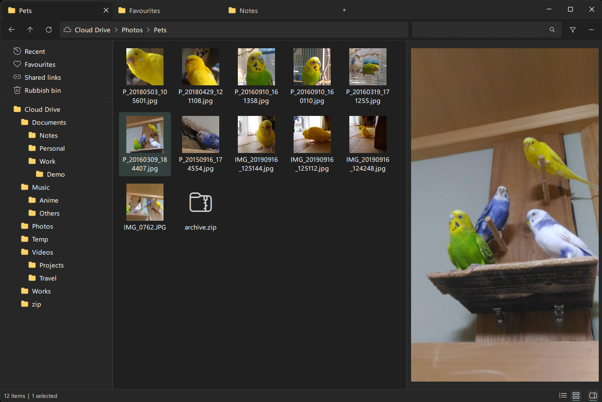
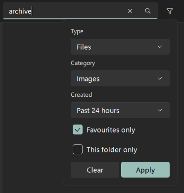
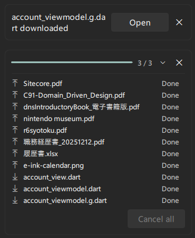

# MEGA Explorer

A Windows Explorer-style desktop client for [MEGA](https://mega.io) cloud storage. It is a browser
for your cloud files, not a sync client.

- Familiar Windows Explorer-like feel
- Previews and thumbnails without downloading anything
- Search and filtering across your whole account
- Open the matching local file or folder in Windows Explorer



**Note:** Windows only, and you need a MEGA account. This is a personal project, published in case
it is useful to someone else, and it is still before 1.0 — anything below may change. It is not
affiliated with MEGA Limited, and comes with no warranty ([LICENSE](LICENSE)): it talks to your
real cloud storage and can permanently delete files there, so use it at your own risk.

## Install

Download the latest `MegaExplorer-<version>-win64.zip` from the
[releases page](https://github.com/tackme31/MegaExplorer/releases), unzip it anywhere, and run
`MegaExplorer.exe`.

To uninstall, delete the folder. Your saved session, the local cache
and the log live in `%LOCALAPPDATA%\MegaExplorer`, and the settings are under
`HKCU\Software\MegaExplorer`; delete those too if you want no trace left.

## Features

### Explorer-style browsing

- Folder tree, breadcrumb address bar and tabs
- Grid and detail views, with sorting
- New folder, rename, copy/cut/paste, move to the Rubbish bin
- Multi-select, and drag-and-drop to move
- Light and dark themes, following the Windows setting

### Previews without downloading

Thumbnails in the grid, and the selected file shown in the preview pane.

- Images, including camera RAW
- Video
- PDF
- Text files
- Zip archives — a list of what is inside

### Search and filtering


Search your whole account or just the current folder, and narrow the results by file type,
category, date modified, or favourite. "Go to folder" takes a result to where it lives.

### Transfers


Upload by dropping files or folders onto the window, download to disk. Transfers run in
parallel, with per-file progress and cancellation in the transfer flyout.

### Quick access, Favourites, Recent, and the Rubbish bin

Pin the folders you keep coming back to, mark files as favourites, and see what was added
recently — each as its own view in the side panel. Deleted items go to the Rubbish bin,
where you can restore them or delete them for good.

### Public links

Create, copy and remove MEGA share links from the context menu. Files that already have a
link are marked in the list.

### Local folder pairing

Point the settings at one local folder that mirrors your MEGA root, and you can open the
matching local file, or reveal it in Windows Explorer. Nothing is synced between the two.

## Roadmap

- [ ] Live updates — watching the server for changes made elsewhere
- [ ] More control over public links (visibility, expiry, and so on)
- [ ] Albums
- [ ] Localisation, starting with Japanese

## Build

Windows only, and the MSVC toolchain — the MEGA SDK's Windows build does not support MinGW.

- Visual Studio 2022, with "Desktop development with C++"
- Qt 6.11 or later, `msvc2022_64`
- CMake 3.21 or later — the copy shipped with Qt (`C:/Qt/Tools/CMake_64/bin/cmake.exe`) works

```
git clone --recursive https://github.com/tackme31/MegaExplorer.git
cd MegaExplorer
third_party\vcpkg\bootstrap-vcpkg.bat
cmake --preset msvc-debug
cmake --build --preset msvc-release
```

The first configure builds the MEGA SDK's dependencies through vcpkg and takes a long time. The
binary lands in `build/msvc-debug/Release/MegaExplorer.exe`.

`CMakePresets.json` expects Qt at `C:/Qt/6.11.1/msvc2022_64` — edit `CMAKE_PREFIX_PATH` there if
yours is somewhere else. [docs/BUILD.md](docs/BUILD.md) has the detail, and the reasoning behind
each of these constraints.

### Packaging

That binary only runs on a machine that already has Qt — to get one that runs anywhere:

```
powershell -File scripts\package.ps1
```

It builds Release and writes `build/msvc-debug/package/MegaExplorer-<version>-win64.zip`, with Qt,
FFmpeg and the MSVC runtime next to the exe and `LICENSE` / `THIRD-PARTY-NOTICES.txt` at the root.
Unzip it anywhere and run `MegaExplorer.exe`; there is nothing to install.

## Author

Takumi Yamada ([@tackme31](https://github.com/tackme31))

## License

MEGA Explorer is released under the [MIT License](LICENSE).

It links against third-party components under their own terms — notably Qt (LGPLv3), FFmpeg
(LGPLv2.1) and LibRaw (LGPLv2.1). `THIRD-PARTY-NOTICES.txt` lists every component with its license
text and, for the LGPL ones, where to get their sources.
