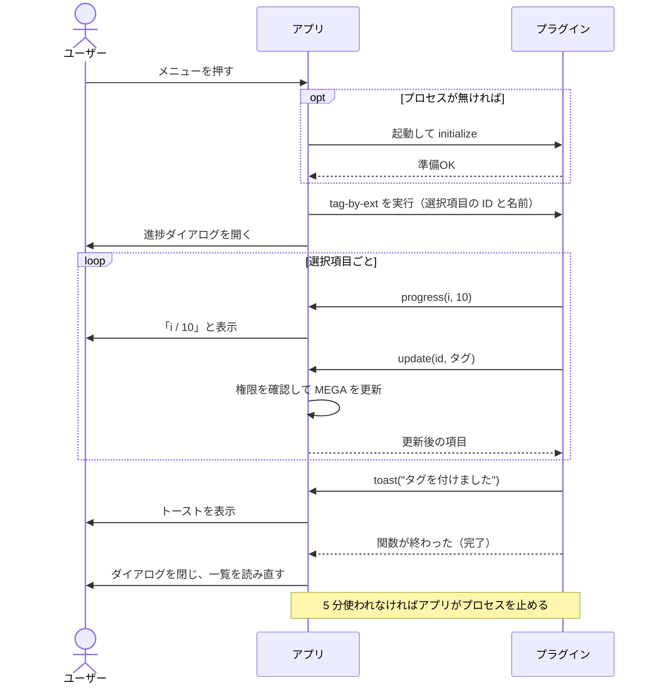
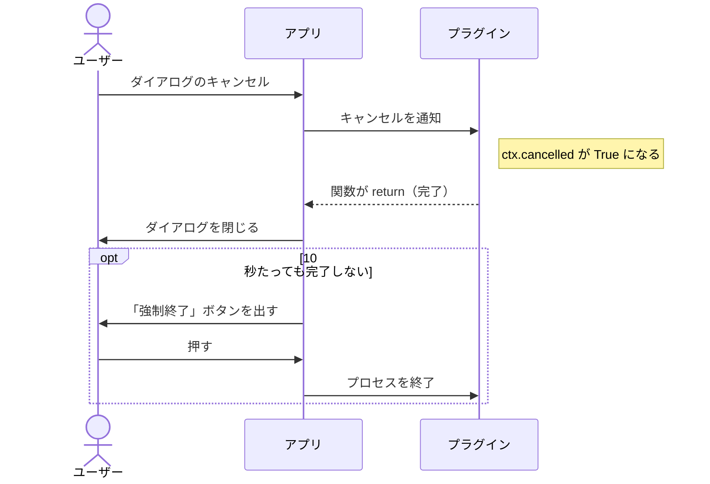
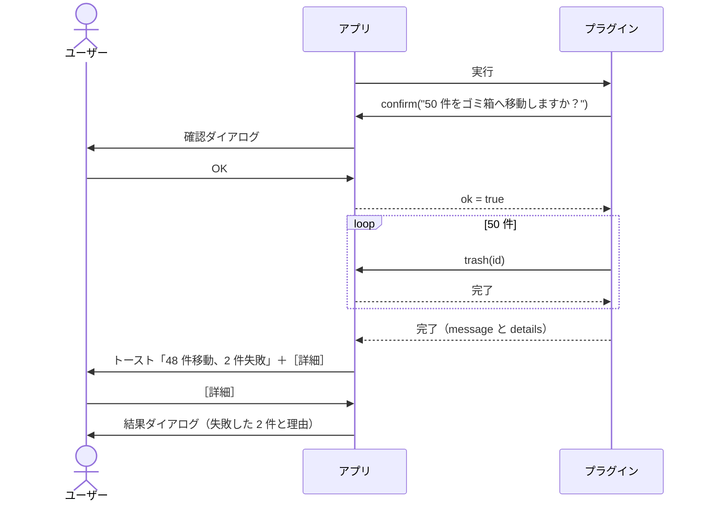
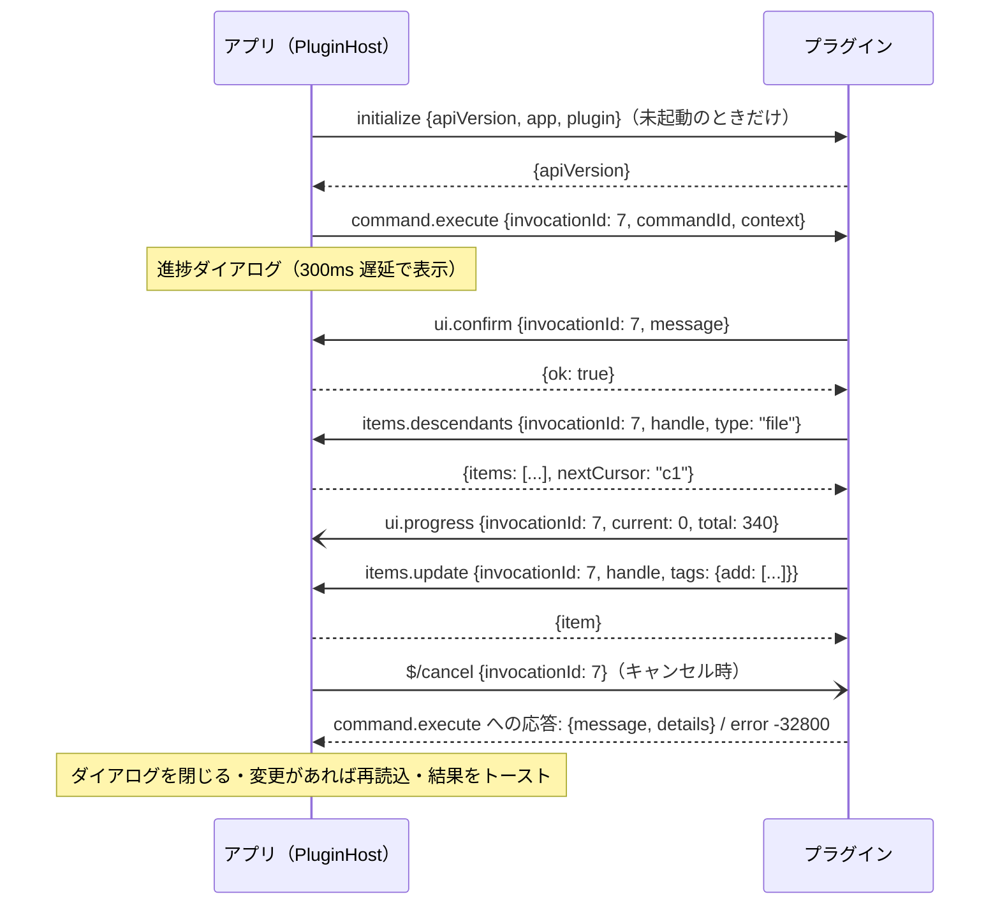

# プラグイン v1 — 別プロセス + JSON-RPC の設計

> **状態: 設計合意済み・未実装（2026-10-01、`92fe496` 時点）。** 前提調査は
> `STUDY_PLUGIN_SUPPORT.md`。そちらの §4（プロセス分離は ABI 自由とクラッシュ隔離を買う）と
> §3（権限宣言はセキュリティにならない）を受けて、**別プロセスのプラグインを stdio 上の JSON-RPC 2.0
> で動かす**形に絞った。言語は問わない。**正式な契約は §6 の JSON-RPC 仕様だけ**で、§7 の Python
> ヘルパはそれを包む一例（サンプル）にすぎない。既存コードの作り直しは要らない — Open with の
> 「プレースホルダ1個を QML が展開する」仕組み（§3）にそのまま乗る。
> 流れをつかむならまず §2-1（コード例とシーケンス図）。決定の一覧は §10、実装時に見直す暫定値は §11。
> 着手順は §9。

## 1. v1 のスコープ

やること:

1. コンテキストメニューに項目を追加（1プラグインから複数、プラグインごとのサブメニュー）
2. クリックでプラグイン側の処理を実行
3. 実行中は進捗ダイアログ（件数表示・キャンセル）
4. アイテムの取得（1件・親と祖先・子・配下すべて）と更新（名前・説明・タグ・お気に入り）
5. アイテムの作成（フォルダ作成・アップロード）、移動・コピー・ゴミ箱へ
6. ユーザーへの問い合わせ（確認・文字入力・選択）
7. トースト表示と、トーストに収まらない長い結果の表示
8. プラグインの導入はフォルダへの配置＋設定画面での有効化（§8）
9. 導入済み一覧（名前・バージョン・権限）— Open with の設定 UI に倣う

やらないこと（v1 では）: 独自プレビュー、操作フック（before/after）、プラグイン独自の設定画面、
条件付きの検索 API（後回し、§6-3 で形だけ決める）、完全削除（ゴミ箱へまで）、
ストア／署名／自動更新、OS サンドボックス（AppContainer）。言語は問わない設計にするが、v1 で
ヘルパとサンプルを用意するのは Python だけ。

## 2. 全体像

```
MegaExplorer.exe (GUI スレッド)                       uv run main.py（例）
┌──────────────────────────────────┐   stdin  ──►   ┌──────────────────────┐
│ PluginRegistry   manifest 群      │   NDJSON        │ 任意の言語            │
│ PluginHost       プロセス1個/プラグイン│ ◄── stdout     │ （Python ならヘルパ    │
│ PluginRpcDispatcher  要求→各サービス│   stderr ─► ログ │   §7 が通信を隠す）    │
│ PluginController (QML 向け)       │                 └──────────────────────┘
└──────────────────────────────────┘
        │ IMegaClient 経由のみ（MEGA に触るのはアプリだけ）
```

- **1プラグイン = 1プロセス**、遅延起動（初回クリック時）、アイドル 5 分で終了。集約ホストは作らない
  （各プラグインが任意の言語の実行ファイルなので、DLL を集約して読む前提が成り立たない）。
- プラグインは MEGA のセッションを受け取らない。**MEGA への読み書きはすべてアプリへの RPC 要求**で、
  アプリ側が権限を検査してから `IMegaClient` を叩く。
- プロセスは **Job Object（KILL_ON_JOB_CLOSE）** に入れる。`uv run` や `py.exe` 経由だと実体の
  `python.exe` は孫プロセスなので、親だけ殺すと孤児が残る。アプリが落ちても Job ごと片付く。

### 2-1. 例: プラグインを1つ書いて動かすまで

細部は §4〜§7。ここでは流れだけを示す。

**マニフェスト（`plugin.json`）** — アプリが起動時に読む。この時点ではプラグインのプロセスは動かない。

```json
{
  "id": "com.example.tagger",
  "name": "タグ付け",
  "version": "0.1.0",
  "run": { "command": "uv", "args": ["run", "main.py"] },
  "permissions": ["items.read", "items.write"],
  "commands": [
    { "id": "tag-by-ext", "title": "拡張子をタグにする", "progress": true },
    { "id": "show-info",  "title": "詳細を表示" }
  ]
}
```

右クリックすると、この宣言だけからメニューが作られる:

```
タグ付け ▶  拡張子をタグにする
            詳細を表示
```

**プラグイン本体（`main.py`）** — 普通の関数を書くだけ。通信はヘルパが隠す。

```python
plugin = Plugin()

@plugin.command("tag-by-ext")                  # マニフェストの id と対応
def tag_by_ext(ctx):
    for i, item in enumerate(ctx.items):       # 選択項目（ID と名前だけ）
        if ctx.cancelled:                      # 進捗ダイアログでキャンセルされた
            return
        ctx.progress(i, len(ctx.items))        # → ui.progress
        ctx.update(item, tags_add=[ext_of(item.name)])   # → items.update
    ctx.toast("タグを付けました")                # → ui.toast

@plugin.command("show-info")
def show_info(ctx):
    info = ctx.get(ctx.item)                   # → items.get
    ctx.toast(f"{info.path} / {info.size} バイト")

plugin.run()                                   # アプリからの呼び出しを待ち続ける
```

（読みやすさ優先の擬似コード。`→` の先が §6-3 のメソッド。）

**「拡張子をタグにする」を押したときの流れ:**



**キャンセルした場合:**



**ユーザーに確認してから処理する場合:**



押さえておく点は3つ:

- **プラグインは MEGA に直接触らない。** 読むのも書くのもアプリに頼み、アプリがそのたびに権限を確認する。
- **最初に渡るのは ID と名前だけ。** 詳細が要るときは ID を渡して取り直す。
- **プラグイン側は普通の関数を書くだけ。** 要求と応答の往復はヘルパが隠す。

## 3. コンテキストメニュー

**Open with と同じ型に乗せる。** `MenuAction` に `PluginCommands` を1個足し、resolver は
「このサイト・ViewKind でプラグイン項目を出してよいか」だけを決める（ゴミ箱では出さない等）。
QML の `ActionCatalog.expand()` がそれを `plugin:<pluginId>/<commandId>` の ID 列に展開し、
`lookup()` が合成エントリ（label / enabled / trigger）を返す。`customOpenWithEntry()` と同形。

- `STUDY_PLUGIN_SUPPORT.md` §1-1 が最大の地雷とした **enum → 文字列 ID 化は不要**になる。
  その後 Open with がこの抜け道を作ったため。
- 出す／出さない（`when` 条件）はマニフェストに**静的に宣言**させ、C++ 側（`src/core` の純関数）で
  評価する。メニューを開くたびにプロセスへ問い合わせる設計にすると、未起動のプラグインの起動待ちで
  メニューが遅れる。
- **プラグインごとにサブメニュー（決定）。** 見出しはプラグインの `name`。コマンドが1個でも畳まずに
  サブメニューにする（将来プラグインごとの設定を持たせるとき、そのサブメニューに「設定…」を置く前提で
  形を揃える）。既存の `rows()` は `group` で畳むので、合成エントリに `group: "plugin:<pluginId>"` を
  付ければ足りる。ただし今の `groups` は固定表なので、見出しとアイコンをプラグイン由来で引けるよう
  `groupLabel()`/`groupIcon()` に分岐を1つ足す。
- 配置は**プロパティの直前の区画**。複数プラグインはマニフェストの `name` 順。「プラグイン」のような
  親メニューは挟まず、各プラグインのサブメニューが右クリックメニューの直下に並ぶ:

  ```
  ダウンロード
  …（既存の項目）
  ─────────────
  Plugin 1        ▶  Menu Item 1-1
                     Menu Item 1-2
  Plugin 2        ▶  Menu Item 2-1
                     Menu Item 2-2
  ─────────────
  プロパティ
  ```
- **条件（`when`）に合わない項目は灰色（決定）。** 例: 画像用のコマンドを持つプラグインで PDF を
  右クリックしたとき、その項目は出るが押せない（Open with と同じ扱い）。サブメニューの中で灰色に
  なるので、トップのメニューは長くならない。全コマンドが灰色でもサブメニュー自体は出す。
  一方、右クリックした**場所**（`when.sites`、ゴミ箱かどうか）による出し分けは灰色ではなく非表示。
  場所が違えば「今は使えない」ではなく「ここには無い」なので。

## 4. マニフェスト（`plugin.json`）

```json
{
  "manifestVersion": 1,
  "id": "com.example.tag-by-ext",
  "name": "拡張子でタグ付け",
  "version": "0.1.0",
  "author": "Example",
  "description": "選択したファイルに拡張子のタグを付けます",
  "apiVersion": 1,
  "run": { "command": "uv", "args": ["run", "--quiet", "main.py"] },
  "permissions": ["items.read", "items.write"],
  "commands": [
    {
      "id": "tag-by-ext",
      "title": "拡張子をタグにする",
      "progress": true,
      "when": {
        "sites": ["selection"],
        "targets": "files",
        "minCount": 1,
        "extensions": []
      }
    }
  ]
}
```

**メニューとコマンド ID はここで確定させ、プロセスには問い合わせない（決定）。** 起動時に問い合わせる
案は、(1) メニューを即時に出すにはアプリ起動時に全プラグインのプロセスを立ち上げる必要があり、
重い import を持つプラグインでは1個で数秒かかる、(2) 何を足し何の権限を使うかを知るためにまず
コードを動かすことになり、§8 の「動かす前に同意を取る」が成り立たない、の2点で退けた。
`commands[].id` がそのまま `command.execute` の `commandId` として送られる。静的な `when` で
表せない状態（例: 処理中だけ灰色）が要るようになったら、起動済みのプラグインにだけ短いタイムアウト付きで
問い合わせ、間に合わなければ宣言どおりに出す形で後から足す。v1 では入れない。

- `id` は逆ドメイン形式。`[a-z0-9.-]` に限定（データフォルダ名・設定キーにも使うため）。
  フォルダ名と一致しなくてもよいが、同じ `id` が2つ見つかったら両方を「重複」として無効扱いにする。
- `when.sites`: `selection`（ファイル選択）/ `folderBackground` / `folderRow`。既存 `MenuSite` と1:1。
  `when.sites` に無い場所では非表示（§3）。省略時は `["selection"]`。
- `when.targets`: `files` / `folders` / `any`。`minCount`/`maxCount`、`extensions`（空は全拡張子）。
  `extensions` は**全選択項目が満たす**か、の判定。どれかを満たさなければ**灰色**（§3）。
- `progress: true` のコマンドは実行中に進捗ダイアログを出す。`false` なら出さない（トーストのみ）。
  `false` でも `ui.confirm` 等の問い合わせ（§6-3）は使える。
- 未知のキーは無視、必須キー欠落・型違いは読み込み時に「エラー」として一覧に出し、理由を表示する
  （有効にはできない）。

### 4-1. 起動コマンド（`run`）

**ホストが知るのは「どう起動するか」だけで、言語は問わない（決定）。**

- `run.command` にパス区切りを含まなければ PATH から探し、含めばプラグインのフォルダからの相対パス
  （自前ビルドの `bin/plugin.exe` など）。作業フォルダは常にプラグインのフォルダ。見つからなければ
  一覧で「エラー: `uv` が見つかりません」と出す。
- **シェルを通さず、引数は配列で渡す。v1 で起動できるのは `.exe` だけ。** `.cmd`/`.bat` は `cmd.exe` を
  挟むことになり、引数のクォート規則が別物になって危ないため。
- **Python のサンプルは `uv run` を使う。** プラグインのフォルダの `pyproject.toml`（またはスクリプト先頭
  のインライン依存宣言）から uv が環境を作ってキャッシュし、Python 本体が無ければ取ってくる。venv の
  置き場や依存の解決をホストが考える必要がなくなる。uv の進捗表示は stderr なので stdout は汚れない。
  利用者側に uv が入っていることが前提。
- 初回起動は依存のダウンロードで長くなりうる。`initialize` のタイムアウトは長め（§11）にし、
  待つ間は進捗ダイアログに「準備中…」と出す。
- ホストは言語固有の環境変数（`PYTHONUTF8` 等）を立てない。プロトコルの約束（§6-1）を守るのは
  プラグイン側の責任で、Python ではヘルパが吸収する。
- 起動コマンドは任意のプログラムを指せるので、同意ダイアログと一覧の詳細に**そのまま表示する**。

## 5. 権限

| 権限 | 許す RPC | 表示文言（案） |
| --- | --- | --- |
| （不要） | メニュー宣言、`ui.*` | — |
| `items.read` | `items.get`、`items.ancestors`、`items.children`、`items.descendants`（後で `items.search`） | アカウント内のファイル・フォルダの名前や属性を読む |
| `items.content` | `items.fetchPreview`、`items.download` | アカウント内のファイルの中身を読む（一時フォルダへ取得） |
| `items.write` | `items.update` | アカウント内のファイル・フォルダの名前・説明・タグ・お気に入りを変更する |
| `items.create` | `items.createFolder`、`items.upload`、`items.copy` | アカウント内にファイル・フォルダを作る（アップロード・コピーを含む） |
| `items.move` | `items.move` | アカウント内のファイル・フォルダを移動する |
| `items.trash` | `items.trash` | アカウント内のファイル・フォルダを**ゴミ箱へ移動する** |

アプリが RPC 要求ごとに検査し、未宣言なら `-32001 PermissionDenied` を返す。

- `items.copy` は既存のものを変えず新しいものを作るだけなので `items.create` に含めた。
- `items.trash` は同意ダイアログで**警告色**で表示する。完全削除の API は v1 では作らない（ゴミ箱から
  戻せる範囲に留める）。
- 権限を細かく分けたのは、同意ダイアログで「このプラグインは何をするか」が読めるようにするため。
  防御のためではない（下の「正直に表示すべきこと」）。

**コンテキストの項目も権限で出し分ける（決定）。** 実行時コンテキスト（§6-4）のうち、権限が要る情報は
未宣言なら `null` で届く。v1 にこの種の項目は無いが、例えばログイン中のユーザー情報を渡すなら
`account.read` を語彙に足し、宣言したプラグインにだけ `context.user` を埋める、という形で増やす。

**操作できるアイテムの範囲（決定）: アカウント全体。** 権限を宣言していれば、`items.*` にはアカウント内の
どのハンドルでも渡せる。読み取り・書き込みとも、範囲の制限は掛けない。

- 当初は「実行の起点（選択項目）とその配下だけ」にする案だった。これを退けた理由は2つ。
  1. 親・祖先・兄弟をたどる処理が塞がれる。入っているフォルダ名でタグを付ける、画像と同じフォルダの
     付属ファイル（`.xmp` 等）を読む、といった処理は起点の外を見る。
  2. **ルートで右クリックすれば起点の配下はアカウント全体になる。** 制限はユーザーが1回の右クリックで
     外せる程度のもので、守れるものが少ない。
- 中間案の「読み取りは全体、書き込みだけ起点の配下」も、2 の理由で退けた。将来、書き込み範囲を
  絞りたくなったら、マニフェストの宣言（例: `"writeScope": "invocation"`）として足す。
- 実行に結び付かない要求（`command.execute` の外から来た `items.*` / `ui.*`）は
  `-32003 InvocationNotActive`。プラグインが勝手に動くのは、ユーザーがメニューを押してから応答を
  返すまでの間だけ、という保証はこれで保つ。

**正直に表示すべきこと（`STUDY_PLUGIN_SUPPORT.md` §3 の帰結）:** この権限は「アプリが代わりに
やってあげる範囲」の制限であって、サンドボックスではない。プラグインのプロセスは PC 上で何でもできる
（DPAPI で保護されたセッションの復号も含む）。よって一覧・同意ダイアログには権限リストとは別に、
**「プラグインはこの PC 上で任意のプログラムを実行できます。信頼できる作者のものだけを
入れてください」を固定文言で必ず出す**。権限リストを安全保証のように見せない。
`network` のような**強制できない権限は語彙に入れない**。

## 6. プロトコル（正式な仕様）

**この節だけがプラグインとアプリの契約。** どの言語で書いても、ここを守れば動く。§7 のヘルパは
この節を包む一例で、ヘルパの関数名や便利機能は仕様ではない。

設計の方針:

- **メソッドは基本の操作だけにする。** 「親の親」のような便利機能は各言語のヘルパが組み立てる。
  仕様に入れると、すべての言語の実装が付き合うことになる。
- **ループでよく使う読み取りは配列で受ける**（`items.get {handles: [...]}`）。変更系は1件ずつ
  （失敗の扱いを1件ごとに決められるように）。
- **件数が大きくなりうる応答は、同じ形で分割する**（`{items, nextCursor}`、§6-5）。

### 6-1. トランスポート

- **JSON-RPC 2.0、stdin/stdout、改行区切り（NDJSON）**。1行1メッセージ、UTF-8。コンパクトに
  シリアライズした JSON は生の改行を含まないので、LSP の `Content-Length` ヘッダよりどの言語でも楽。
- stderr はアプリのログに `[plugin:<id>]` 付きで流す（`print` デバッグの逃げ場）。
- **プラグイン側の約束はこの3つだけ**: stdin/stdout は UTF-8 で読み書きする、1メッセージ書くたびに
  flush する、stdout には RPC 以外を書かない。
- JSON-RPC のバッチ（配列で複数送る形）は v1 では使わない。

### 6-2. ハンドルとアイテムの表現

64bit ハンドルは JSON 数値にすると JS 系クライアントで精度が落ちるので**文字列**。
形式は **MEGA の base64 ノードハンドル**（リンクに出る 8 文字）。ログやデバッグでリンクと
突き合わせやすい。変換は SDK の `MegaApi::handleToBase64` / `base64ToHandle` で、`src/mega` の
中に閉じる。不正な文字列が来たら `-32602 Invalid params`。

表現は2種類。**コンテキストで渡すのは ID と名前だけ**で、それ以上が要る処理は ID を
メインプロセスに投げて取り直す。コンテキストを軽く保ち、値の鮮度の問題を `items.*` の応答に寄せるため。

`ItemRef` — コンテキストに入る形。クリック時点のスナップショット:

```json
{ "handle": "AbCd1234", "name": "cat.jpg", "type": "file", "parent": "XyZw9876" }
```

`Item` — `items.*` が返す形。要求した時点の最新:

```json
{ "handle": "AbCd1234", "name": "cat.jpg", "type": "file", "parent": "XyZw9876",
  "size": 123456, "mtime": 1727740800, "path": "/写真/cat.jpg",
  "favourite": false, "description": "", "tags": ["cat"] }
```

- `type`: `"file"` / `"folder"`。`when` の評価にもう使っている情報で、ファイルとフォルダで処理を
  分けるたびに `items.get` を呼ばせずに済む。
- `parent`: 親のハンドル。ルートでは `null`。アプリは常に持っている情報なので `ItemRef` にも含め、
  親（`items.get`）や兄弟（`items.children`）を追加の往復なしで引けるようにした。
- `path`: ルートからの表示用パス。フォルダは末尾に `/` を付けない。ルートは `/`。

### 6-3. メソッド一覧

**ホスト → プラグイン**

| メソッド | 種別 | params → result |
| --- | --- | --- |
| `initialize` | 要求 | プロセス単位のコンテキスト（§6-4）→ `{apiVersion}`。版が合わなければ起動失敗 |
| `command.execute` | 要求 | 実行単位のコンテキスト（§6-4）→ `{message?, details?}`（§6-6） |
| `$/cancel` | 通知 | `{invocationId}`。協調的キャンセル |
| `shutdown` | 要求 | `null` → `null`。応答後に `exit` 通知。3 秒で応答しなければ Job ごと終了 |
| `exit` | 通知 | プロセスを終了してよい |

**プラグイン → ホスト**

すべての要求・通知に `invocationId` を付ける（`log` を除く）。実行中でない ID なら `-32003`。

読み取り（`items.read`）:

| メソッド | params → result |
| --- | --- |
| `items.get` | `{handles: [h…]}` → `{items: [Item]}`（順序は handles と同じ） |
| `items.ancestors` | `{handle, limit?}` → `{items: [Item]}`。**近い順**（親が先頭、ルートが末尾）。`limit` 省略でルートまで全部。ルート自身なら空配列 |
| `items.children` | `{handle, type?, cursor?, limit?}` → `{items: [Item], nextCursor}`（§6-5） |
| `items.descendants` | `{handle, type?, cursor?, limit?}` → `{items: [Item], nextCursor}`。配下すべて、深さ優先の前順（フォルダはその中身より先） |
| `items.search`（後回し） | `{handle, query, cursor?, limit?}` → `{items: [Item], nextCursor}`。`query` の形は実装時に決める |

`type` は `"file"` / `"folder"`、省略で両方。名前や拡張子での絞り込みは `items.search` の担当とし、
`children` / `descendants` には入れない。

親・祖先・兄弟はこの組み合わせで表せるので、専用のメソッドは作らない:

| やりたいこと | 要求 |
| --- | --- |
| 親 | `items.ancestors {handle, limit: 1}`（または `items.get {handles: [ref.parent]}`） |
| 親の親 | `items.ancestors {handle, limit: 2}` の 2 件目 |
| ルートからのパス上のフォルダ | `items.ancestors {handle}` を逆順に |
| 兄弟 | `items.children {handle: ref.parent}` |
| 選択フォルダの配下のファイル全部 | `items.descendants {handle, type: "file"}` |

中身（`items.content`）:

| メソッド | params → result |
| --- | --- |
| `items.fetchPreview` | `{handle}` → `{path}`。サーバ側プレビュー（約1000px の JPEG）。無ければ `-32002` |
| `items.download` | `{handle}` → `{path}`。ファイル本体。上限サイズあり（§11） |

`path` はアプリが用意した一時フォルダの中。実行が終わるとアプリが消すので、残したいものは
プラグインが `plugin.dataDir` へコピーする。

変更（`items.write`）:

| メソッド | params → result |
| --- | --- |
| `items.update` | `{handle, name?, description?, favourite?, tags?: {add?, remove?}}` → `{item: Item}` |

作成・移動・ゴミ箱（`items.create` / `items.move` / `items.trash`）:

| メソッド | 権限 | params → result |
| --- | --- | --- |
| `items.createFolder` | create | `{parent, name, onConflict?}` → `{item: Item}` |
| `items.upload` | create | `{parent, localPath, name?, onConflict?}` → `{item: Item}`。完了まで応答しない |
| `items.copy` | create | `{handle, to, name?, onConflict?}` → `{item: Item}` |
| `items.move` | move | `{handle, to, onConflict?}` → `{item: Item}` |
| `items.trash` | trash | `{handle}` → `{}`。ゴミ箱への移動（戻せる） |

`onConflict`（同じ名前が移動先にあるとき）: `"fail"`（既定、`-32004 Conflict`）/ `"rename"`
（「名前 (1)」のように付け直す。既存の `SPEC_NAME_CONFLICT_*` と同じ規則）/ `"replace"`（`upload` のみ。
既存ファイルの新しいバージョンとして上げる）。

`items.upload` の `localPath` はプラグインが用意したファイル（`plugin.dataDir` の中や、
`items.download` で受け取った一時ファイルを加工したもの）。アプリの既存のアップロード経路を通るので、
転送一覧にも出る。

ユーザーへの問い合わせ（権限不要。要求で、ユーザーが答えるまで応答しない）:

| メソッド | params → result |
| --- | --- |
| `ui.confirm` | `{title?, message, okLabel?, danger?}` → `{ok: bool}` |
| `ui.input` | `{title?, message, default?, placeholder?}` → `{value: string \| null}`（キャンセルで `null`） |
| `ui.choose` | `{title?, message, options: [{id, label}], default?, multiple?}` → `{selected: id \| [id] \| null}` |

表示（権限不要。通知で、応答は無い）:

| メソッド | params |
| --- | --- |
| `ui.progress` | `{current?, total?, message?}`。`total` ありで確定バー＋「12 / 340」、なしで不確定バー |
| `ui.toast` | `{text, kind: "info" \| "success" \| "error"}` |
| `log` | `{message, level: "debug" \| "info" \| "warning" \| "error"}`。アプリのログへ |

**エラーコード**

| コード | 意味 |
| --- | --- |
| `-32601` / `-32602` / `-32603` | JSON-RPC 標準（メソッド無し / 引数不正 / 内部エラー） |
| `-32001` PermissionDenied | 権限を宣言していない |
| `-32002` NotFound | ハンドルが存在しない（他の端末で消された等）、プレビューが無い |
| `-32003` InvocationNotActive | 実行中でない `invocationId` |
| `-32004` Conflict | `onConflict: "fail"` で同名が存在した |
| `-32010` MegaError | MEGA 側の失敗。`data.reason` に既存 `NotificationController::ErrorReason` 相当の分類 |
| `-32800` Cancelled | キャンセルされた（LSP と同値）。`command.execute` の応答に使う |

### 6-4. コンテキスト

「プロセス起動時に1回」と「実行ごと」に分けて送る。Sitecore の `Context` に倣った形だが、
プロセス境界を越えるので**生きたオブジェクトではなくスナップショット**。

```json
// initialize の params
{ "apiVersion": 1,
  "app":    { "version": "0.4.0", "locale": "ja-JP" },
  "plugin": { "id": "com.example.hello", "version": "0.1.0",
              "dir": "C:\\…\\plugins\\hello", "dataDir": "C:\\…\\plugin-data\\com.example.hello" } }

// command.execute の params
{ "invocationId": 7, "commandId": "hello",
  "context": { "site": "selection", "view": "cloudDrive",
               "folder": { "handle": "XyZw9876", "name": "写真", "type": "folder", "parent": "ROOT0000" },
               "items":  [ { "handle": "AbCd1234", "name": "cat.jpg", "type": "file", "parent": "XyZw9876" } ] } }
```

- `site`: `selection` / `folderBackground` / `folderRow`。`view`: 既存 `ViewKind` の文字列表現
  （`cloudDrive` / `search` / `favourites` / `recent` / …）。
- `folder` は表示中のフォルダ。ルートでも `ItemRef` で、検索やお気に入りのように「表示中のフォルダ」が
  無いビューでは `null`。
- `items` は選択項目。`folderBackground` / `folderRow` ではそのフォルダ1件。
- 権限が要る項目は未宣言なら `null`（§5）。v1 には無い。
- ログアウト・アカウント切り替えのときは**全プラグインのプロセスを止める**。プロセス単位の
  コンテキストも、プラグインが保持しているハンドルも、前のアカウントのまま残ってしまうため。

### 6-5. 分割取得（`children` / `descendants` / `search`）

- 1回の応答は最大 `limit` 件（既定と上限は §11）。続きがあれば `nextCursor` に不透明な文字列、
  無ければ `null`。続きは同じ params に `cursor` を足して呼ぶ。
- **最初の呼び出しの時点で一覧を確定させる。** 途中で他の端末から追加・移動されても、列挙が二重に
  なったり飛んだりしない。各ページを返す時点で消えていた項目は飛ばす（件数が `limit` 未満のページが
  途中に来ることがある）。
- カーソルはその実行の中でだけ有効。実行が終わったら捨てる。

### 6-6. 実行の結果

`command.execute` の応答:

```json
{ "message": "48 件移動しました（2 件失敗）",
  "details": "失敗:\n/写真/a.jpg — 移動先に同じ名前があります\n/写真/b.jpg — 見つかりません" }
```

- `message` があればトーストに出す（成功の色）。無ければ何も出さない（プラグインが `ui.toast` で
  自分で出した場合など）。
- `details` があれば、トーストに［詳細］ボタンを付け、押すと**結果ダイアログ**（プレーンテキスト、
  選択・コピー可、スクロール）を開く。トーストに収まらない長い結果はここに入れる。
- エラー応答なら、`message` を添えたエラーのトーストを出す。`-32800` はキャンセルとして扱い、
  トーストは出さない。

### 6-7. 1回の実行の流れ（メソッド名で）



実線矢印（`->>` と `-->>`）が要求と応答、開いた矢印（`-)`）が応答の要らない通知。

- **v1 は1プラグインにつき同時1実行**。実行中はそのプラグインのメニュー項目を灰色にする。
- 問い合わせダイアログは進捗ダイアログの上に出す。問い合わせ中に進捗ダイアログのキャンセルが
  押されたら、問い合わせを閉じて「キャンセル」と答え（`ok: false` / `null`）、続けて `$/cancel` を送る。
- 変更系（update / create / move / trash）が1回でも成功した実行の終了時に、`BulkOperationRunner` の
  既定リフレッシュと同じく表示中のタブを読み直す（アプリは継続監視をしないため）。1件ごとにはしない。
- キャンセル後 10 秒応答が無ければ、ダイアログに「強制終了」を出してプロセスを殺す。
- プロセスが落ちたら進行中の実行を失敗扱いにし、エラートースト（stderr 末尾をログへ）。

## 7. Python ヘルパ（`megaexplorer_plugin`）— 仕様ではなくサンプル

§6 を Python で包んだ一例。Python でプラグインを書く人が JSON-RPC を意識しないための薄いライブラリで、
1ファイル、標準ライブラリのみ。ホストはこれの存在を知らない。他の言語なら §6 を直接実装するか、
同じ考え方で自前のヘルパを書けばよい。**ここにある関数名・便利機能は仕様ではない。**

```python
from megaexplorer_plugin import Plugin

plugin = Plugin()

@plugin.command("tag-by-folder")
def tag_by_folder(ctx):
    files = list(ctx.descendants(ctx.item, type="file"))    # 分割取得をまとめて読む
    if not ctx.confirm(f"{len(files)} 件にタグを付けますか？"):
        return
    for n, f in enumerate(files):
        ctx.check_cancelled()
        ctx.progress(n, len(files), f.name)
        parent = ctx.parent(f)                               # = ancestors(limit=1)[0]
        ctx.update(f, tags_add=[parent.name])
    return f"{len(files)} 件にタグを付けました"               # → {message}

plugin.run()
```

ヘルパが §6 に足している便利機能:

| ヘルパ | 中身（§6 のどれを呼ぶか） |
| --- | --- |
| `ctx.items` / `ctx.item` / `ctx.folder` | コンテキストの `ItemRef`。`item` は1件のときだけ、それ以外は `None` |
| `ctx.get(x)` / `ctx.get_many(xs)` | `items.get` |
| `ctx.parent(x, up=1)` | `items.ancestors {limit: up}` の最後の1件。ルートを越えたら `None` |
| `ctx.ancestors(x)` | `items.ancestors` |
| `ctx.children(x, type=None)` / `ctx.descendants(x, type=None)` | 分割取得を**ジェネレータ**にしたもの。`for` で回すと必要な分だけ取りに行く |
| `ctx.fetch_preview(x)` / `ctx.download(x)` | `items.fetchPreview` / `items.download`。`Path` を返す |
| `ctx.update(x, …)` / `ctx.create_folder(…)` / `ctx.upload(…)` / `ctx.copy(…)` / `ctx.move(…)` / `ctx.trash(x)` | 同名の `items.*` |
| `ctx.confirm(…)` / `ctx.input(…)` / `ctx.choose(…)` | `ui.confirm` / `ui.input` / `ui.choose` の結果だけを返す |
| `ctx.progress(…)` / `ctx.toast(…)` / `ctx.log(…)` | `ui.progress` / `ui.toast` / `log` |
| `ctx.cancelled` / `ctx.check_cancelled()` | `$/cancel` を受けたか。後者は受けていたら例外で抜ける |
| `ctx.data_dir` | `plugin.dataDir` を `Path` で |
| ハンドラの戻り値 | 文字列なら `{message}`、`Result(message, details)` なら両方 |

- 引数 `x` は**ハンドルの文字列でも `ItemRef` / `Item` でも受ける**。`ctx.children(f.parent)` とも
  `ctx.children(ctx.folder)` とも書ける。
- `invocationId` はヘルパが自動で付ける。
- `ctx.items[i].name` はクリック時点の名前。最新が要るときは `ctx.get()` で取り直す、と docstring に書く。

実装上の注意（Python 固有。仕様ではない）:

- Windows ではパイプの文字コードが既定で cp932 → stdin/stdout をバイナリで直接 UTF-8 として読み書きする。
- パイプ先の stdout はブロックバッファ → 毎回 flush。
- プラグインの `print()` が RPC ストリームを壊す → 起動時に元の stdout の fd を退避し、fd 1 と
  `sys.stdout` を stderr に付け替える。
- stdin は専用の読み取りスレッドが読み、`$/cancel` だけはその場で旗を立てる。ハンドラが RPC を
  呼ばずに計算や待機をしている間にもキャンセルを受け取れるようにするため。
- 罠（試作で確認済み）: daemon スレッドで `sys.stdin.buffer` を読むと、終了時に BufferedReader の
  ロックを握ったまま Fatal Python error で落ちる。fd を `os.read` で直接読めば起きない。

### 7-1. `plugin_sample/`

リポジトリ直下に置き、機能ごとに1プラグイン。各サンプルは `plugin.json` / `main.py` /
`pyproject.toml` を持ち、`uv run --quiet main.py` で起動する。ヘルパは**各サンプルのフォルダに
同じものを1部ずつ置く**。プラグインフォルダは単独でコピーされる前提なので、`../` を参照する相対
import やパス依存は、置いた先で壊れる。正本は `plugin_sample/_helper/` に置き、同期スクリプトで配る。

| フォルダ | 試す機能 |
| --- | --- |
| `_helper/` | 共通ヘルパの正本と同期スクリプト |
| `hello/` | メニュー・コンテキスト・トーストだけ（権限なし） |
| `multi-menu/` | 複数項目・`when` 条件で灰色になること・場所による非表示 |
| `slow-count/` | 進捗ダイアログとキャンセル |
| `item-info/` | `get` / `ancestors` / `children` / `descendants` / `fetchPreview` |
| `tag-tools/` | `update` でタグ・説明の書き込み（配下を再帰的に） |
| `ask/` | `confirm` / `input` / `choose` |
| `organize/` | `createFolder` / `copy` / `move` / `trash`、`onConflict`、`details` での失敗一覧 |
| `make-report/` | 配下を集計してテキストを作り `upload` する |
| `no-permission/` | 未宣言の権限を使って `PermissionDenied` を確かめる |

## 8. 導入（フォルダ配置）と設定画面

**導入はフォルダへの配置で行う（決定）。** 設定画面からのインストール（コピー・zip 展開）は作らない。
コピーや展開のコードが要らず、更新は上書きで済み、`plugin_sample/` の中身をそのまま置いて試せる。

**置き場所**: `<AppLocalData>/plugins/<任意のフォルダ名>/plugin.json`。プロファイル（`AppIdentity`）
配下なので、dev プロファイルに置いたプラグインはリリース版に混ざらない。

**読み込むタイミング**: アプリ起動時と、設定画面の「再読み込み」ボタンだけ。フォルダの常時監視は
v1 では入れない。実行中のプラグインのファイルを上書きした場合、反映されるのは次のプロセス起動時
（アイドル終了後、または再読み込みで止めた後）。

**既定で無効、有効化に同意を取る（決定）。** フォルダに置かれただけでメニューに項目が出て、押せば
任意のコードが動く、という状態を作らない。置かれる経路は他のソフトのこともあれば、zip を展開した
結果のこともある。

1. 新しく見つかったプラグインは「無効」で一覧に出る。メニューには出ず、プロセスも起動しない。
2. 設定画面で有効トグルを入れると**同意ダイアログ**（名前・版・作者・起動コマンド・メニュー項目・
   権限一覧・§5 の固定文言）を出し、承認したら有効にする。
3. 承認時に `id` と**権限の集合**を QSettings に記録する。次回以降の読み込みで、マニフェストの権限が
   記録より**増えていたら**無効に戻し、一覧で「権限が追加されました — 再承認が必要」と表示する。
   減った場合と、コードや版・メニューだけが変わった場合は、承認を維持する（開発中に毎回聞かれると
   使い物にならないため）。

**後回し: 新しく見つかったときのダイアログ。** v1 では、見つかったプラグインは設定画面に「無効」で
並ぶだけで、ユーザーが自分で見に行く必要がある。後で、起動時や再読み込みの際に未承認のプラグインが
見つかったら「新しいプラグインが見つかりました」というダイアログを出し、プラグインごとに要求
（起動コマンド・メニュー項目・権限）を並べて、その場で有効化できるようにする。中身は上の同意ダイアログ
の複数件版なので、同意ダイアログを1件分の部品として作っておけば足りる。「後で」を選んだら
無効のまま、同じプラグインについては次回以降は聞かない。

QSettings のキーは `plugins/<id>/enabled` と `plugins/<id>/approvedPermissions`。いずれも新規キー
なので移行は不要。

**アンインストール = フォルダの削除（決定）。** 起動時・再読み込み時の走査で、記録はあるのにフォルダが
見つからない `id` があれば、そのプラグインはアンインストールされたとみなし、次の2つを**自動で消す**:

- QSettings の `plugins/<id>/…`（再配置したら再同意から）
- データフォルダ `<AppLocalData>/plugin-data/<id>/`（`initialize` の `plugin.dataDir`）

ユーザーがプラグインのフォルダを消すのはアンインストールしたいときだけ、という前提。設定画面の
プラグインページと README に「アンインストールするには、プラグインのフォルダを削除してください。
プラグインが保存したデータも一緒に消えます」と書く。

- **罠: 更新のつもりで「消してから置き直す」と、間に再読み込みや起動を挟んだ場合にデータが消える。**
  更新は上書きで行う、と同じ案内に書き添える。走査は起動時と再読み込みボタンだけなので、アプリを
  閉じずに消して置き直すぶんには消えない。
- 削除はそのプラグインのプロセスを止めてから行う（プラグインのプロセスがデータフォルダのファイルを
  開いたままだと消せないため）。消せなかったら次回の走査で再試行し、ログに残す。

**一覧画面**: Open with のページと同じマスター／ディテール。

- 上部: 「プラグインフォルダを開く」「再読み込み」、アンインストール方法の1行
- 左: プラグイン名・版・状態（有効 / 無効 / 再承認が必要 / エラー / 重複）・有効トグル
- 右: 説明、作者、id、起動コマンド、メニュー項目の一覧、権限（§5 の表示文言で列挙、`items.trash` は
  警告色）、固定の警告文、エラー時はその理由（起動コマンドが見つからない、を含む）、
  「このプラグインのフォルダを開く」

削除ボタンは置かない。消すにはフォルダを消して再読み込みする（同じ操作を2箇所に持たない）。

## 9. 着手順（各段が単独で確認できる順）

| 段 | 内容 | 規模 | ここで確認できること |
| --- | --- | --- | --- |
| P1 | `PluginManifest`（解析・検証・`run.command` の解決）、`PluginRegistry`（走査・重複検出・承認記録との突き合わせ・消えたプラグインの記録とデータの削除）、設定画面の一覧・再読み込み・有効化と同意ダイアログ・権限増加時の再承認 | M | プロセス無しで一覧・権限表示・有効化が動く |
| P2 | `PluginHost`（QProcess + Job Object + NDJSON）、`initialize`/`command.execute`/`shutdown`、メニュー統合（`MenuAction::PluginCommands` + `when` 評価 + サブメニュー・灰色化）、`ui.toast`、結果の `message`、Python ヘルパの骨格、`hello/` `multi-menu/` | M〜L | 右クリック→サブメニュー→プラグイン実行→トースト |
| P3 | 進捗ダイアログ、`ui.progress`、`$/cancel`、強制終了、同時1実行の灰色化、`slow-count/` | M | 件数表示とキャンセル |
| P4 | 読み取り: `items.get`/`ancestors`/`children`/`descendants`（分割取得）/`fetchPreview`/`download`、権限検査、`IMegaClient` に説明・タグの読み取り追加、`item-info/` `no-permission/` | M | 取得系と権限拒否 |
| P5 | `items.update`（rename/description/tags/favourite）、`IMegaClient` に `setNodeDescription`/`addNodeTag`/`removeNodeTag`、実行後の再読込、`tag-tools/` | M | 更新系 |
| P6 | `ui.confirm`/`input`/`choose`、結果の `details` と結果ダイアログ、`ask/` | M | 問い合わせと長い結果 |
| P7 | `items.createFolder`/`upload`/`copy`/`move`/`trash`、`onConflict`、`organize/` `make-report/` | M | 作成・整理系 |
| P8 | アイドル終了、再読み込み時・ログアウト時のプロセス停止、クラッシュ時の扱い | S〜M | 運用まわり |
| 後回し | 新しいプラグインが見つかったときの一括同意ダイアログ（§8）、`items.search` | S / M | — |

SDK は v10.17.0 で `MegaNode::getTags()` / `getDescription()` と `MegaApi::addNodeTag` /
`removeNodeTag` / `setNodeDescription` を既に持っている（`megaapi.h` で確認）。作成・移動・コピー・
ゴミ箱・アップロードは `IMegaClient` に既にある（`createFolder` / `moveNode` / `copyNode` /
`moveToRubbish` / アップロード経路）。新規 SDK は不要。

**置き場所の案**（`docs/ARCHITECTURE.md` の層に合わせて）:

- `src/core/plugin/` — `PluginManifest`、`when` 評価、NDJSON の分割、権限表、RPC ディスパッチャ、
  分割取得のカーソル管理（`IMegaClient` と `IPluginTransport` だけに依存。gmock で単体テスト可能）
- `src/platform/` — `QProcessPluginTransport`（QProcess + Job Object。`QProcess::
  setCreateProcessArgumentsModifier` で `CREATE_SUSPENDED` 起動→Job に入れてから再開、で取りこぼしを防ぐ）
- `src/qml/PluginController` — 一覧モデル、メニュー用の `count`/`labelAt`/`enabledAt`/`trigger`、
  実行中状態（進捗・問い合わせダイアログのバインド先）
- `qml/components/PluginProgressDialog.qml`、`PluginPromptDialog.qml`（confirm/input/choose）、
  `PluginResultDialog.qml`、`SettingsDialog.qml` にプラグインページ、`ActionCatalog.qml` に展開、
  `ToastStack.qml` に `showPluginToast`（［詳細］付き）

これは人間が切るフェーズとして進め、ログは `docs/PROGRESS.md` に書く想定。`docs/ROADMAP.md` の
見送り行「プラグイン対応」は、着手を決めた時点で `docs/REQUESTS.md` に `[削除]` を書いて外す。

## 10. 決定の一覧（2026-10-01）

| 項目 | 決定 | 節 |
| --- | --- | --- |
| メニューの宣言 | マニフェストで静的に。プロセスには問い合わせない | §4 |
| 起動方法 | マニフェストの `run` に起動コマンド。言語は問わず、Python のサンプルは `uv run` | §4-1 |
| メニューの配置 | プラグインごとのサブメニュー（1個でも畳まない）、プロパティの直前 | §3 |
| 条件に合わない項目 | 灰色。場所による出し分けは非表示 | §3 |
| 操作範囲 | アカウント全体（読み書きとも） | §5 |
| 導入・アンインストール | フォルダの配置・削除。既定で無効、同意して有効化、権限が増えたら再同意。データも自動で消す | §8 |
| ハンドル | MEGA の base64 ノードハンドル（文字列） | §6-2 |
| コンテキスト | ID と名前（＋型・親）だけ。詳細は ID で取り直す | §6-2、§6-4 |
| 契約 | JSON-RPC 仕様（§6）だけ。Python ヘルパはサンプル | §6、§7 |
| 親・祖先 | `items.ancestors {limit}` に吸収。「親」はヘルパのラッパー | §6-3、§7 |
| 列挙 | `children` / `descendants` を分割取得。条件付き検索は後回し | §6-3、§6-5 |
| 追加機能 | 問い合わせ（confirm/input/choose）、作成・移動・コピー・ゴミ箱、長い結果（`details`） | §6-3、§6-6 |

## 11. 暫定で決めたこと（実装時に見直す）

| 項目 | 暫定値 | 見直す観点 |
| --- | --- | --- |
| `initialize` のタイムアウト | 5 分 | uv の初回の依存取得にかかる時間 |
| アイドル終了 | 5 分 | 重い import を持つプラグインの再起動コスト |
| キャンセル後の強制終了ボタン | 10 秒 | — |
| 分割取得の `limit` | 既定 500、上限 1000 | 1ページの JSON の大きさと往復回数 |
| `items.download` の上限 | 2 GB | 一時フォルダの空き容量 |
| `onConflict` の既定 | `"fail"` | プラグイン作者が毎回指定する手間 |
| 完全削除 | 作らない（ゴミ箱まで） | 要望が出たら `items.delete` ＋別権限 |
| 問い合わせのタイムアウト | なし（ユーザーが答えるまで待つ） | — |
| `details` の形式 | プレーンテキスト | 表やリンクが欲しくなったら Markdown |
| `items.search` の `query` | 未定 | 名前・拡張子・更新日・タグのどれまで |
